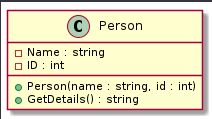
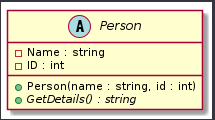
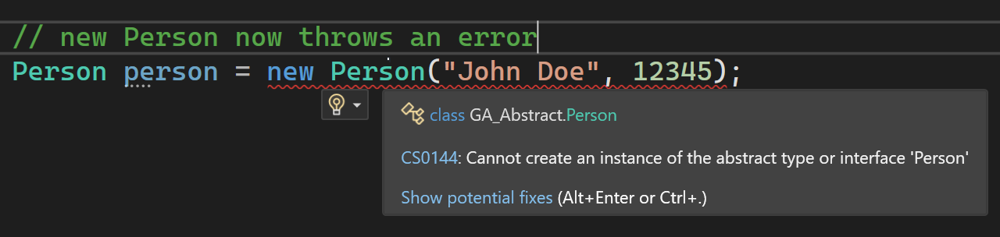
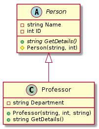
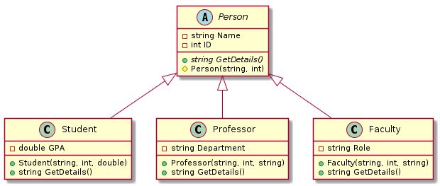

# Guided Assignment: Abstract Classes in C# ( School Database )

## Introduction

The `abstract` keyword in C# is used to define abstract classes and abstract methods. Here's an explanation of what `abstract` does in different contexts:

1. Abstract Classes:
   - An abstract class is a class that cannot be instantiated directly (i.e., you cannot create objects of an abstract class using the `new` keyword).
   - Abstract classes are designed to be base classes for other classes (known as derived classes or subclasses).
   - Abstract classes can have both abstract and non-abstract (concrete) methods.
   - Abstract classes can have fields, properties, and constructors like any other class.
   - Abstract classes are used to provide a common base with shared functionality and structure for derived classes.
   - When a class is declared as `abstract`, it signifies that it is meant to be extended by other classes, and it may contain abstract methods that must be implemented by its derived classes.

   Example of an abstract class:
   ```csharp
   public abstract class Shape
   {
       public abstract double CalculateArea(); // Abstract method
       public void DisplayInfo()
       {
           Console.WriteLine("This is a shape.");
       }
   }
   ```

2. Abstract Methods:
   - An abstract method is a method declared in an abstract class but does not have a method body (implementation).
   - Abstract methods are intended to be overridden (provided with an implementation) by any concrete (non-abstract) derived class.
   - Any class that inherits from an abstract class with abstract methods must provide an implementation for those abstract methods.

   Example of an abstract method within an abstract class:
   ```csharp
   public abstract class Animal
   {
       public abstract void MakeSound(); // Abstract method
   }
   ```

In summary, the `abstract` keyword in C# is used to create abstract classes that serve as blueprints for other classes and to define abstract methods that must be implemented by derived classes. It enforces a structure and allows for polymorphism, as objects of derived classes can be treated as instances of the abstract base class.
**Why Abstract Classes for a School Database:**
- **Common Interface:** Provides a unified interface for all person types in the school system.
- **Flexibility:** Allows for the specific implementation details of each derived class (e.g., professors, faculty, students) while sharing a common set of properties and methods.
- **Code Reusability:** Enables reusing code for common properties and methods, reducing redundancy.

**Differences from Interfaces:**
- Abstract classes can contain implemented methods and state, whereas interfaces traditionally cannot (prior to C# 8.0).
- A class can inherit from only one abstract class but can implement multiple interfaces.

**Pros and Cons:**
- **Pros:** Code reusability, enforced structure for derived classes, and flexibility in implementation.
- **Cons:** Single inheritance limitation and potential for increased complexity.

***Real World Example in School System:***
- **Person Database:** An abstract class `Person` could define common properties like `Name` and `ID` and methods like `GetDetails()`, while derived classes like `Student`, `Professor`, and `Faculty` implement specific properties and behaviors (e.g., `Grade` for students, `Teach()` for professors).

---

## Requirements

**Project Setup: (12 points)**
1. Create a new C# project named "GA_AbstractClass."
2. Ensure the project setup follows the required naming convention and includes comments with your name and the current date.

**Abstract Class Implementation: (13 points)**
3. Implement an abstract class named `Person` with common properties and an abstract method for getting details.
4. Ensure that the `Person` class is marked as `abstract`.
5. Properly define common properties (`Name` and `ID`) in the `Person` class.

**Concrete Class Implementations: (18 points)**
6. Implement concrete classes `Student`, `Professor`, and `Faculty` that inherit from `Person`.
7. Define specific fields and properties for each derived class.
8. Override the `GetDetails()` method in each derived class to provide role-specific information.

**Fields & Properties: (13 points)**
9. Appropriately define fields and properties in each concrete class to represent their specific attributes (e.g., GPA, Department, Role).

**Constructors: (13 points)**
10. Implement constructors in each class to initialize their properties with proper parameterization.
11. Ensure that the constructor in the `Person` class is marked as `protected`.

**Testing: (17 points)**
12. Perform comprehensive testing of all classes and methods.
13. Create test cases to verify the correctness of the implemented classes.
14. Ensure that the testing covers different scenarios and provides correct output for each class.

**Code Compilation: (14 points)**
15. Ensure the code compiles and runs without errors.

These requirements are based on the rubric and specify the necessary tasks for the assignment with the project name "GA_AbstractClass."

---
### Business Case ( A real world example of why would implement an Abstract class )

1. **Modeling School Personnel**: In a real-world school or educational institution, there are different types of individuals, each with their own specific roles, responsibilities, and attributes. These individuals include students, professors, and faculty members.
    
2. **Common Properties**: Despite their different roles, there are common properties shared among all individuals, such as `Name` and `ID`. It's essential to have a unified way to represent these common properties for consistency and code reusability.
    
3. **Specific Behaviors**: Each type of individual has its own unique properties and behaviors. For example, students have a `GPA`, professors have a `Department`, and faculty members have a `Role`. These specific attributes and behaviors need to be encapsulated within the appropriate classes.
    
4. **Abstraction for Common Behavior**: By defining an abstract base class `Person`, we ensure that all individuals share common properties and behaviors. The `Person` class provides a blueprint for these shared characteristics, such as the `Name` and `ID` properties.
    
5. **Polymorphism**: Using an abstract class allows us to leverage polymorphism, which means that we can treat objects of derived classes (e.g., `Student`, `Professor`, `Faculty`) as instances of the base class (`Person`). This simplifies code and allows for flexibility in handling various individuals within the school.

---
## Narrative 

Maplewood Academy, a diverse school, wants a single console application to manage its data for students, teachers, administrators, and support staff, with common data and role-specific features.

To meet this requirement, you will create an abstract base class with shared information like names and contact details. Then, specific roles, such as students, teachers, and administrators, will inherit from this base class. This will allow you to add unique details and functions for each role.

Key Project Requirements:

1. **Single Database:** Develop a console app to serve as a central database for Maplewood Academy.
2. **Abstract Base Class:** Design a base class for common data.
3. **Role-Specific Inheritance:** Create role-specific classes inheriting from the base class.
4. **Role-Specific Features:** Enable role-specific functions (e.g., grades for students, class management for teachers).
5. **Efficiency and Unity:** Ensure efficient data management while keeping everyone connected.
6. **Flexibility:** Make the system adaptable for future changes or new roles.

With this approach, you will achieve efficient data management while catering to the unique needs of each role within the school.

---
## Step By Step

### **Project Setup:**
1. Create a new C# project named "GA_AbstractClass_YourName."
2. Include your name and the current date as comments in the main class or file.

---
## Step 1: Start by creating our Class `Person`


> This is a UML ( Unified Modeling Language ). It visually helps us mock up what a class would contain.
> - Top: Uppercase C, to indicate this is a class. And then the class name, Person
> - Middle: Fields
> - Bottom: Constructor and Method Signature
> This is a very clean way of visualizing what a class may look like and how they connect.

We will use UML diagrams to visualize what our class may look like. The result of the person class is below.

#### Explanation
In our school database, we know every Person who is in the school database will have 2 related pieces of information, irregardless of their role. Name and ID. So we will start with those as fields.

Because we want to guarentee that anyone who's in our database is required to have a name and id, we will make a constructor to take those two properties.

And finally for convience we will create a method that will format the information for display.

> Notice that how the class relates to the uml up top.

### Create a new class, Person, and add the following code.

```csharp
    public class Person {

        // Fields
        public string Name { get; set; }
        public int ID { get; set; }

        // Constructor to initialize common properties.
        public Person(string name, int id)
        {
            Name = name;
            ID = id;
        }

        // Method to return details about the person.
        public string GetDetails()
        {
            return $"Name: {Name}, ID: {ID}";
        }
    }
```

### Test our code

1. Go to main, and create an instance of our class Person. Then call the GetDetails method.

`Program.cs`
```csharp
    static void Main(string[] args) {
        // Create an instance of the Person class
        Person person = new Person("John Doe", 12345);

        // Call the GetDetails method and display the output
        string details = person.GetDetails();
        Console.WriteLine(details);
    }
```

### Expected Output

```console
Name: John Doe, ID: 12345
```

We now have a working Person class.

### Thinking like a developer

So our person class is working, but we now ask ourselves, 
## "Would we ever want to make an instance of Person?". 

Probably not. Everyone in the school will have a role ( Professor, Faculty, or Student ). Giving people the ability to possibly create a Person instance will cause a headache.

To **fix** that, we are going to turn our class ***Abstract***.

---
### Step 2: Abstract Class

#### Explination

C# has a ***class modifier***, ( a keyword that changes how C# treats a class ), called `abstract`.

This keyword is placed before the word class

```csharp
    public abstract class Person { // Code }
```

An abstract class is a special class that lets you define classes and certain behaviors, but there are 2 key differences.
1. You cannot create an instance of an abstract class.
2. You can label a method as `abstract`. This lets you define a method signature ( the name, return type, and arguments ), but not define a body. We do this so it enforces that derived childen will have a method by that name, but it's up to the children to define the behavior.

Let's update our `Person` class to be abstract.

### Alter the Person class


> Here is the UML for Person as an abstract class. Notice the C is now an A, for abstract. And the method name *GetDetails()* is now in italics. This indicates it will be an abstract method.

1. Put the word `abstract` in front of class, in the `Person.cs` file.
    - This is all you need to turn a class abstract.
2. In our *GetDetails()* method, place abstract infront of the return type, and remove the body.

```csharp
    public abstract string GetDetails();
```

The full code with changes appears below.

```csharp
using System;

// 1. Define an abstract class called Person as the base for all individuals in the school.

public abstract class Person
{
    public string Name { get; set; }
    public int ID { get; set; }

    // Constructor to initialize common properties.
    protected Person(string name, int id)
    {
        Name = name;
        ID = id;
    }

    // 2. Abstract method to be implemented by derived classes to return details about the person.
    public abstract string GetDetails();
}
```

### Test our code

You will now have errors




This is because we cannot create a `new instance` of Person, since it is abstract.

So how can we use it then? By inheiriting from it.

---

## Step 3: Derived class ( Professor )


> This UML shows how a parent child relationship is shown in a UML. Notice that the Person constructor has a yellow diamond next to the name. This signifies the constructor is now `protected` instead of public. This make sense because the dervied children need access to the Constructor to override it, but it does not need to be used outside of the class or children.

Lets create the Professor class, which derives from the Person class.

### Create a new class, Professor.

1. Inherit from `Person.cs` and add the following code.

    - We have our class specific field, Department.
    - Our class constuctor that inherits from base.
    - Now notice that we `override` our **GetDetails()** method.
        - This is how we add our own functionality to the method.

```csharp
    // Professor class
    public class Professor : Person
    {
        public string Department { get; set; }

        public Professor(string name, int id, string department) : base(name, id)
        {
            Department = department;
        }

        public override string GetDetails()
        {
            return $"{Name}, ID: {ID}, Department: {Department}";
        }
    }
```

### Test out your code

`Program.cs`
```csharp
        // Create a new Professor object
        Professor professor1 = new Professor("Dr. Smith", 101, "Computer Science");

        // Call the GetDetails method to get information about the professor
        string professorInfo = professor1.GetDetails();

        // Output the information
        Console.WriteLine("Professor Information:");
        Console.WriteLine(professorInfo);
```

### Expected Output

```console
Professor Information:
Dr. Smith, ID: 101, Department: Computer Science
```

Our code now works like we expect it to, and we don't have to worry about someone making an instance of Person.

Let's finish by adding our two final classes.

--- 

## Step 4: Creating a Faculty and Student class


> Here is the full UML for all of our classes. Using this diagram create the Student and Faculty classes. See how far you can get just based off the UML before using the code samples below.

### Student Class

`Student.cs`
```csharp
// Student class
public class Student : Person
{
    public double GPA { get; set; }

    public Student(string name, int id, double gpa) : base(name, id)
    {
        GPA = gpa;
    }

    public override string GetDetails()
    {
        return $"{Name}, ID: {ID}, GPA: {GPA}";
    }
}
```

### Faculty class

`Faculty.cs`
```csharp

// Faculty class
public class Faculty : Person
{
    public string Role { get; set; }

    public Faculty(string name, int id, string role) : base(name, id)
    {
        Role = role;
    }

    public override string GetDetails()
    {
        return $"{Name}, ID: {ID}, Role: {Role}";
    }
}
```

---


### Testing the Code

Add the following code to your `Program.cs`.

1. We create a List of Person to represent a potential student database.
2. We now add 2 instances of each object to our student Database.
3. Finally we loop through the List calling the **GetDetails()** method.


```csharp
using System;
using System.Collections.Generic;

class Program
{
    static void Main(string[] args)
    {
        // Create a list to hold Person objects, renamed as "schoolDatabase"
        List<Person> schoolDatabase = new List<Person>();

        // Add two instances of each derived class
        schoolDatabase.Add(new Student("John Doe", 12345, 3.8));
        schoolDatabase.Add(new Student("Alice Smith", 67890, 3.5));
        schoolDatabase.Add(new Professor("Dr. Smith", 101, "Computer Science"));
        schoolDatabase.Add(new Professor("Dr. Johnson", 102, "Mathematics"));
        schoolDatabase.Add(new Faculty("Jane Brown", 201, "Librarian"));
        schoolDatabase.Add(new Faculty("Mike Davis", 202, "Admissions"));

        // Loop through the list and display information for each person
        foreach (var person in schoolDatabase)
        {
            Console.WriteLine(person.GetDetails());
            Console.WriteLine();
        }

        Console.ReadLine();
    }
}

```
---

### Step 5: Add your own class, Mascot.

Create another class Mascot. Add a field, constructor, and override the GetDisplay method. Add two instances to our school database.

---

### Step 6: Submit your project on Canvas

Upload your project onto GitHub and submit your project on canvas.


---

## Rubric

| Name                        | Description                                                           | Points |
|-----------------------------|-----------------------------------------------------------------------|--------|
| Project Setup               | Correct project setup with naming and comments.                       | 12     |
| Abstract Class Implementation | Proper implementation of the abstract class `Person`.                | 13     |
| Concrete Classes            | Correct implementation of concrete classes `Student`, `Professor`, and `Faculty`. | 18     |
| Fields & Properties         | Appropriately defined fields and properties.                          | 13     |
| Constructors                | Proper constructors for initializing properties.                      | 13     |
| Testing                     | Comprehensive testing of all classes and methods.                     | 17     |
| Code Compilation            | Error-free code compilation and execution.                            | 14     |
| Total                       |                                                                       | 100    |

